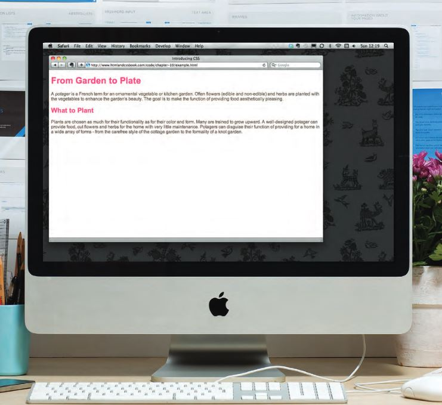
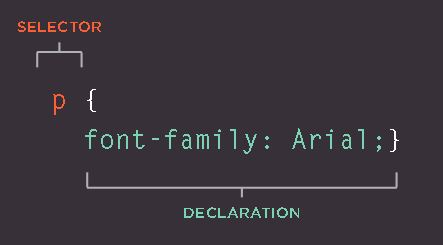
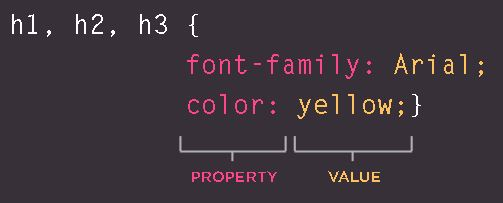
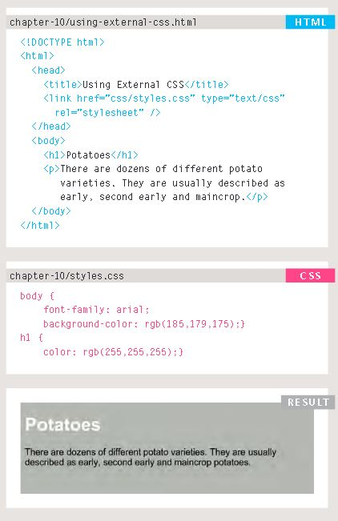
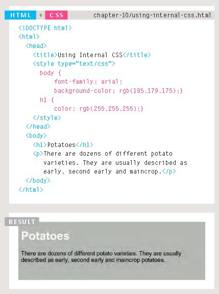

# Introduction To CSS

## Introducing CSS

- What CSS does.

- How CSS works

- Rules, properties, and values

### how to make your web pages more attractive, controlling the design of them using CSS

CSS allows you to create rules that specify how the content of an element should appear

## UnderstandIng CSS: thinking Inside the Box

The key to understanding how CSS works is to imagine that there is an invisible box around every HTML element.

### Block & Inline Elements

- Block level elements look like they start on a new line.

- Inline elements flow within the text and do not start on a new line.

#### CSS allows you to create rules that control the way that each individual box (and the contents of that box) is presented

Using CSS, you could add a border around any of the boxes, specify its width and height, or add a background color. You could also control text inside a box — for example, its color, size, and the typeface used.

### CSS associates StyLe rules with htML elements

CSS works by associating rules with HTML elements. These rules govern how the content of specified elements should be displayed. A CSS rule contains two parts: a selector and a declaration.

This rule indicates that all 
elements should be shown in the Arial typeface.

- Selectors indicate which element the rule applies to. The same rule can apply to more than one element if you separate the element names with commas.Declarations indicate how the elements referred to in the selector should be styled.

- Declarations are split into two parts (a property and a value), and are separated by a colon.

### CSS Properties affect How Elements Are Displayed

CSS declarations sit inside curly brackets and each is made up of two parts: a property and a value, separated by a colon. You can specify several properties in one declaration, each separated by a semi-colon.

This rule indicates that all <h1>, <h2> and <h3> elements should be shown in the Arial typeface, in a yellow color.

- Properties indicate the aspects of the element you want to change. For example, color, font, width, height and border.

- Values specify the settings you want to use for the chosen properties. For example, if you want to specify a color property then the value is the color you want the text in these elements to be.

### Using External CSS

- **<link>** The <link> element can be used in an HTML document to tell the browser where to find the CSS file used to style the page. It is an empty element (meaning it does not need a closing tag), and it lives inside the <head> element. It should use three attributes.

- **:href** This specifies the path to the CSS file (which is often placed in a folder called css or styles).

- **type** This attribute specifies the type of document being linked to. The value should be text/css.

- **rel** This specifies the relationship between the HTML page and the file it is linked to. The value should be stylesheet when linking to a CSS file.

### Using InternaL CSS

**<style>** You can also include CSS rules within an HTML page by placing them inside a <style> element, which usually sits inside the <head> element of the page.

The <style> element should use the type attribute to indicate that the styles are specified in CSS. The value should be text/css.

When building a site with more than one page, you should use an external CSS style sheet. This:

- Allows all pages to use the same style rules (rather than repeating them in each page).

- Keeps the content separate ●from how the page looks.

- Means you can change the styles used across all pages by altering just one file (rather than each individual page).

### CSS Selectors

There are many different types of CSS selector that allow you to target rules to specific elements in an HTML document.

