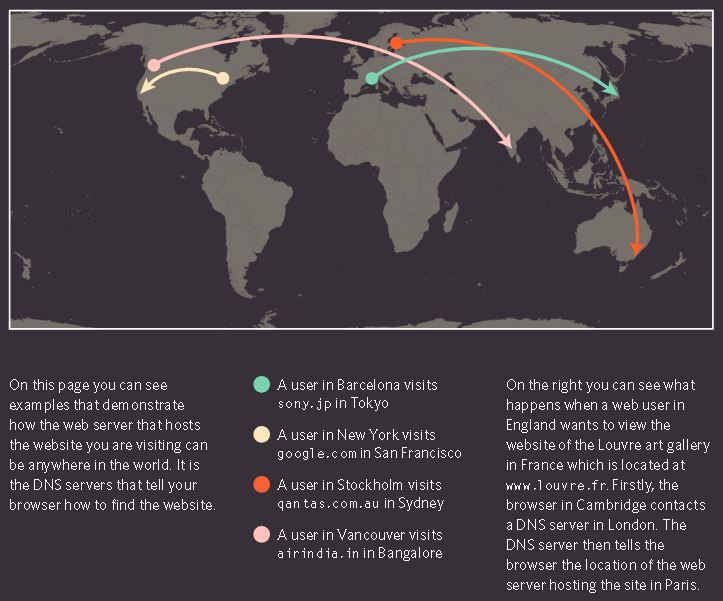
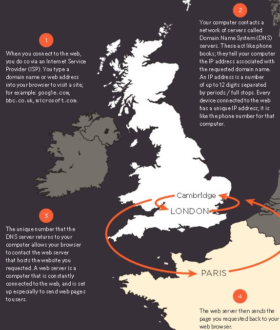
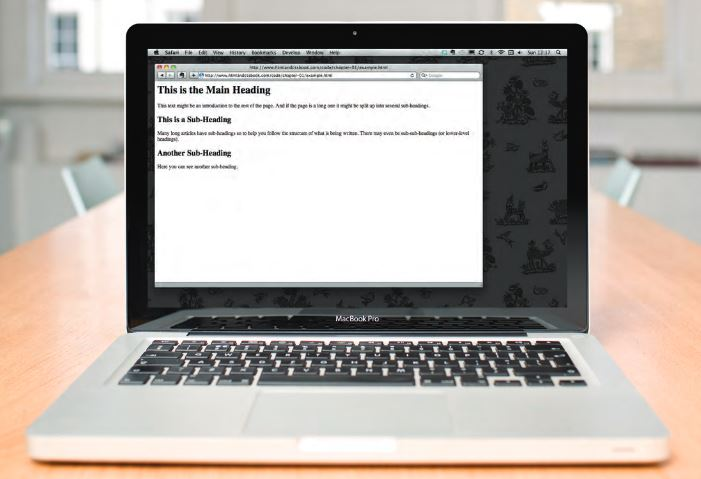
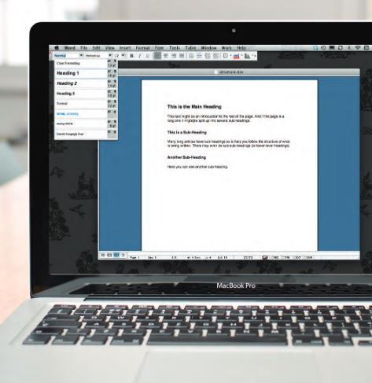
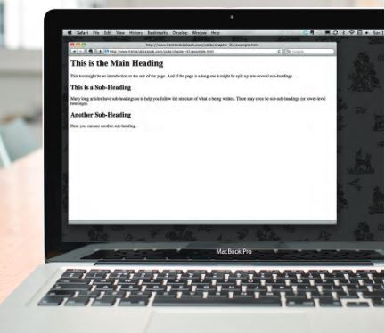
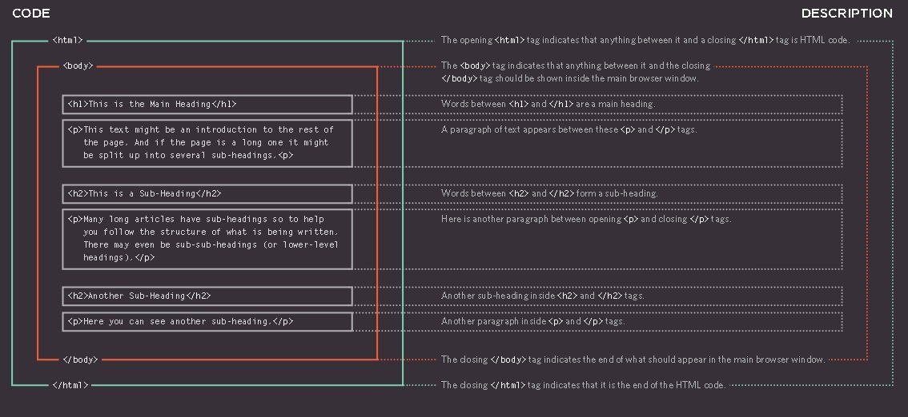
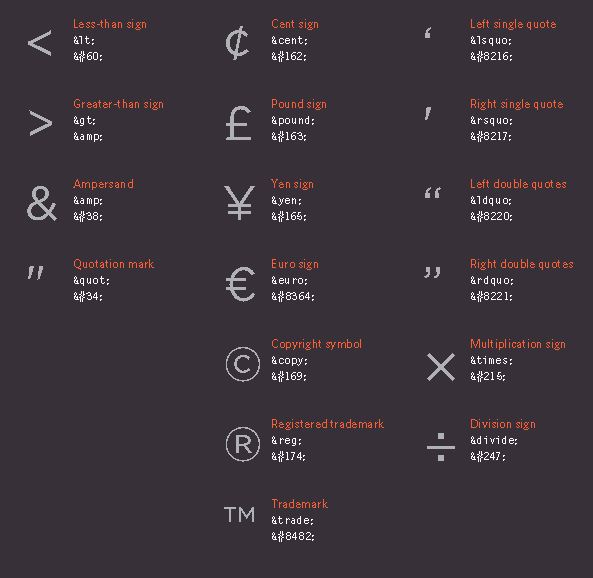

# Introductory HTML and JavaScript


Photo by [Tea Hub](https://swall.teahub.io)

## What is Webpages.?

When you are looking at a website, it is most likely that your browser will be receiving HTML and CSS from the web server that hosts the site.

They also include extra content such as images, audio, video, or animations.

## How the web works.?

When you visit a website, the web server hosting that site could be anywhere in the world. In order for you to find the location of the web server, your browser will first connect to a Domain Name System (DNS) server.



Photo by Ducket HTML Book

In another meaning **You Can Visit Any Website From Any Place Any Where Any Time**



Photo by Ducket HTML Book

## Structure

What you will learn by the end of this is:

- Understanding structure

- Learning about markup

- Tags and elements



Photo by Ducket HTML Book

**How Pages use Structure**

The structure is very similar when a news story is viewed online (although it may also feature audio or video). This is illustrated on the right with a copy of a newspaper alongside the corresponding article on its website.

Now think about a very different type of document — an insurance form. Insurance forms often have headings for different sections, and each section contains a list of questions with areas for you to fill in details or checkboxes to tick. Again, the structure is very similar online.

**Structuring word documents**

The use of headings and subheadings in any document often reflects a hierarchy of information.

This might be expanded upon under subheadings lower down on the page

Each topic might have a new paragraph, and each section can have a heading to describe what it covers.

On below, you can see a simple document in Microsoft Word. The different styles for the document, such as different levels of heading, are shown in the drop down box.



Photo by Ducket HTML Book

On the previous page you saw how structure was added to a Word document to make it easier to understand. We use structure in the same way when writing web pages.



Photo by Ducket HTML Book

**HTML describes the Structure of pages**

You can see the HTML code for this page below.

Don't worry about what the code means yet. We start to look at it in more detail on the next page.

~~~
<html>
    <body>
        <h1>This is the Main Heading</h1>
         <p>This text might be an introduction to the rest of  the page. And if the page is a long 
         one it might  be split up into several sub-headings.<p>
        <h2>This is a Sub-Heading</h2>
         <p>Many long articles have sub-headings so to help  you follow the structure of what is being written.  There may even be sub-sub-headings (or lower-level  headings).</p>
        <h2>Another Sub-Heading</h2>
         <p>Here you can see another sub-heading.</p>
    </body>
</html>
~~~

## HTML uses elements to describe the structure of pages

Lets look to the code a little bit closer in this example:

Each element has an opening tag and a closing tag



## Summary
### Structure

- HTML pages are text documents.

- HTML uses tags (characters that sit inside angled Xbrackets) to give the information they surround special meaning.

- Tags are often referred to as elements.

- Tags usually come in pairs. The opening tag denotes the start of a piece of content; the closing tag denotes the end.

- Opening tags can carry attributes, which tell us more Xabout the content of that element.

- Attributes require a name and a value.

- To learn HTML you need to know what tags are Xavailable for you to use, what they do, and where they can go.

## Extra Markup

Here is some Extra Mark up Tags

**DOCTYPE**

- ```<!DOCTYPE html>```

DOCTYPES tell browsers which version of HTML you are using.

**Comments**

- ```<!-- comment goes here -->```

You can add comments to your code between the ```<!-- and -->``` markers.

**ID Attribute & Class Attribute**

- ```id="quote"```

- ```class="important"```

The id and class attributes allow you to identify particular elements.

**Block Elements**

- ```<h1>, <p>, <ul>, and <li>```

**Inline Elements**

- ```<a>, <b>, <em>, and ```

**Grouping Text & Elements in a Block**

- ```<div>```

**Grouping Text & Elements Inline**

- ```<span>```

The ```<div>``` and ```<span>``` elements allow you to group block-level and inline elements together.

**Iframes**

- ```<iframe>```

Cut windows into your web pages through which other pages can be displayed.

**Information about your page**

- ```<meta>```

Allows you to supply all kinds of information about your web page.

**Escape Characters**

There are some characters that are used in and reserved by HTML code. (For example, the left and right angled brackets.)

When using escape characters, it is important to check the page in your browser to ensure that the correct symbol shows up. This is because some fonts do not support all of these characters and you might therefore need to specify a different font for these characters in your CSS code.

for example see the next Image:



Escape characters are used to include special characters in your pages such as <, >, and ©.
