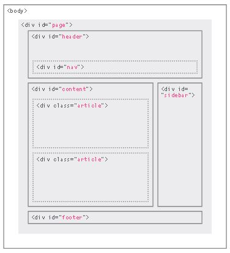
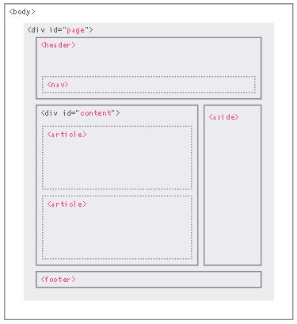
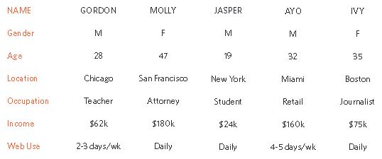

# Introductory HTML and JavaScript


Photo by [Tea Hub](https://swall.teahub.io)

What you will learn by the end of this article is:

- [Understanding structure](#structure)

- [Learning about markup](#extra-markup)

- [Tags and elements](#structure)

- [HTML5 layout elements](#html5-layout)

- [How to approach building a site](#)

- [Understanding your audience and their needs](#)

- [How to present information visitors want to see](#)

## What is Webpages.?

When you are looking at a website, it is most likely that your browser will be receiving HTML and CSS from the web server that hosts the site.

They also include extra content such as images, audio, video, or animations.

## How the web works.?

When you visit a website, the web server hosting that site could be anywhere in the world. In order for you to find the location of the web server, your browser will first connect to a Domain Name System (DNS) server.


Photo by Ducket HTML Book

In another meaning **You Can Visit Any Website From Any Place Any Where Any Time**


Photo by Ducket HTML Book

# Structure


Photo by Ducket HTML Book

**How Pages use Structure**

The structure is very similar when a news story is viewed online (although it may also feature audio or video). This is illustrated on the right with a copy of a newspaper alongside the corresponding article on its website.

Now think about a very different type of document — an insurance form. Insurance forms often have headings for different sections, and each section contains a list of questions with areas for you to fill in details or checkboxes to tick. Again, the structure is very similar online.

**Structuring word documents**

The use of headings and subheadings in any document often reflects a hierarchy of information.

This might be expanded upon under subheadings lower down on the page

Each topic might have a new paragraph, and each section can have a heading to describe what it covers.

On below, you can see a simple document in Microsoft Word. The different styles for the document, such as different levels of heading, are shown in the drop down box.


Photo by Ducket HTML Book

On the previous page you saw how structure was added to a Word document to make it easier to understand. We use structure in the same way when writing web pages.


Photo by Ducket HTML Book

**HTML describes the Structure of pages**

You can see the HTML code for this page below.

Don't worry about what the code means yet. We start to look at it in more detail on the next page.

~~~
<html>
    <body>
        <h1>This is the Main Heading</h1>
         <p>This text might be an introduction to the rest of  the page. And if the page is a long 
         one it might  be split up into several sub-headings.<p>
        <h2>This is a Sub-Heading</h2>
         <p>Many long articles have sub-headings so to help  you follow the structure of what is being written.  There may even be sub-sub-headings (or lower-level  headings).</p>
        <h2>Another Sub-Heading</h2>
         <p>Here you can see another sub-heading.</p>
    </body>
</html>
~~~

## HTML uses elements to describe the structure of pages

Lets look to the code a little bit closer in this example:

Each element has an opening tag and a closing tag


## Summary
### Structure

- HTML pages are text documents.

- HTML uses tags (characters that sit inside angled Xbrackets) to give the information they surround special meaning.

- Tags are often referred to as elements.

- Tags usually come in pairs. The opening tag denotes the start of a piece of content; the closing tag denotes the end.

- Opening tags can carry attributes, which tell us more Xabout the content of that element.

- Attributes require a name and a value.

- To learn HTML you need to know what tags are Xavailable for you to use, what they do, and where they can go.

# Extra Markup

Here is some Extra Mark up Tags

**DOCTYPE**

- ```<!DOCTYPE html>```

DOCTYPES tell browsers which version of HTML you are using.

**Comments**

- ```<!-- comment goes here -->```

You can add comments to your code between the ```<!-- and -->``` markers.

**ID Attribute & Class Attribute**

- ```id="quote"```

- ```class="important"```

The id and class attributes allow you to identify particular elements.

**Block Elements**

- ```<h1>, <p>, <ul>, and <li>```

**Inline Elements**

- ```<a>, <b>, <em>, and ```

**Grouping Text & Elements in a Block**

- ```<div>```

**Grouping Text & Elements Inline**

- ```<span>```

The ```<div>``` and ```<span>``` elements allow you to group block-level and inline elements together.

**Iframes**

- ```<iframe>```

Cut windows into your web pages through which other pages can be displayed.

**Information about your page**

- ```<meta>```

Allows you to supply all kinds of information about your web page.

**Escape Characters**

There are some characters that are used in and reserved by HTML code. (For example, the left and right angled brackets.)

When using escape characters, it is important to check the page in your browser to ensure that the correct symbol shows up. This is because some fonts do not support all of these characters and you might therefore need to specify a different font for these characters in your CSS code.

for example see the next Image:


Escape characters are used to include special characters in your pages such as <, >, and ©.


# HTML5 Layout

### TraditionaL HTML Layouts

For a long time, web page authors used ```<div>``` elements to group together related elements on the page (such as the elements that form a header, an article, footer or sidebar). Authors used class or id attributes to indicate the role of the ```<div>``` element in the structure of the page.



### New HTML5 Layout ELements

HTML5 introduces a new set of elements that allow you to divide up the parts of a page. The names of these elements indicate the kind of content you will find in them. They are still subject to change, but that has not stopped many web page authors using them already.



## Headers & Footers

```<header> <footer>```

The ```<header> and <footer>``` elements can be used for:

- The main header or footer that appears at the top or bottom of every page on the site.

- A header or footer for an individual ```<article> or <section>``` within the page.

## Navigation

```<nav>```

The ```<nav>``` element is used to contain the major navigational blocks on the site such as the primary site navigation.

## Articles

```<article>```

The ```<article>``` element acts as a container for any section of a page that could stand alone and potentially be syndicated.

## Asides

```<aside>```

The ```<aside>``` element has two purposes, depending on whether it is inside an ```<article>```
element or not.

When the ```<aside>``` element is used inside an ```<article>``` element, it should contain information that is related to the article but not essential to its overall meaning.

## Sections

```<section>```

The ```<section>``` element groups related content together, and typically each section would have its own heading.

## Heading groups

```<hgroup>```

The purpose of the ```<hgroup>``` element is to group together a set of one or more ```<h1>``` through ```<h6>``` elements so that they are treated as one single heading.

## Figures

```<figure> <figcaption>```

It can be used to contain any content that is referenced from the main flow of an article (not just images).

## Sectioning ELements

```<div>```

The ```<div>``` element will remain an important way to group together related elements, because you should not be using these new elements that you have just met for purposes other than those explicitly stated.

## Linking around BLock-Level Elements

HTML5 allows web page authors to place an ```<a>``` element around a block level element that contains child elements.

This allows you to turn an entire block into a link.

This is not a new element in HTML5, but it was not seen as a correct usage of the ```<a>``` element in earlier versions of HTML.

## Helping older browsers understand

Older browsers that do not know the new HTML5 elements will automatically treat them as inline elements. Therefore, to help older browsers, you should include the line of CSS on the left which states which new elements should be rendered as block-level elements.

Also, IE9 was the first version of Internet Explorer to allow CSS rules to be associated with these new HTML5 layout elements. In order to style these elements using earlier versions of IE, you need to use a simple JavaScript known as the HTML5 shiv or HTML5 shim.

You do not need to understand JavaScript to use it. You can just link to a copy that Google hosts on its servers. It should be placed inside a conditional comment which checks if the browser version is less than (hence the lt) IE9.

Unfortunately, this workaround does require that anyone using IE8 or earlier versions of IE has JavaScript enabled in their browser. If they do not have JavaScript enabled then they will not be able to see the content of these HTML5 elements

**Summary**

HTML5 Layout

- The new HTML5 elements indicate the purpose of different parts of a web page and help to describe its structure.

- The new elements provide clearer code (compared Xwith using multiple ```<div>``` elements).

- Older browsers that do not understand HTML5 elements need to be told which elements are block-level elements.

- To make HTML5 elements work in Internet Explorer 8 (and older versions of IE), extra JavaScript is needed, which is available free from Google.

# Process & Design

Who is the site For?

Every website should be designed for the target audience—not just for yourself or the site owner. 

It is therefore very important to understand who your target audience is.

You Should ask yourself some questions about the people you would expect to be interested in your site.

Is it for the entire world?, think again it is unlikely to be relevant to everyone. Right?

Even if the site has a wide appeal, you can still think about the demographics of a sample of the target audience. Like ...

**Target Audience:** Individuals:

- What is the age range of your target audience?

- Will your site appeal to more women or men?

- Which country do your visitors live in?

- Do they live in urban or rural areas?

- What is the average income of visitors?

- What level of education do they have?

- What is their marital status?

- What is their occupation?

- How many hours do they work per week?

- How often do they use the web?

- What kind of device do they use to access the web?

**Target Audience:** Companies:

- What is the size of the company?

- What is the position of people in the company?

- Will visitors be using the site for someone else Other than themselves?

- How large is the budget they control?



