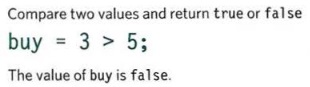

# Java Script

### How JavaScript can be used in  browsers to make websites more interactive:

This photo by [purelogics.net](https://www.purelogics.net/blog/)

We need to know how to build web pages using HTML and CSS with no experience.

what JavaScript allows us to do ?
Making web pages more interactive by:

**1. ACCESS CONTENT**
By using Java Script to select any element or text  Like:

- Select the text inside all of the <hl> elements on a page.
- Select any elements that have a class attribute with a value.
- Find out what was entered into a text input
**2. MODIFY CONTENT**
Use Java Script to add or remove any content:
- Add a paragraph of text after the first <hl> element.
- Change the value of class attributes to trigger new CSS rules for those elements.
- Change the size or position of an  element.

**3. PROGRAM RULES**
You can specify a set of steps for the browser to follow , which allows it to access or change the content of a page. like:

- A gallery script could check which image a user clicked on and display a larger version of that image.
- A mortgage calculator could collect values from a form
- An animation the viewport or as it called the viewport could check the dimensions of the browser window and move an image to the bottom of the viewable area.

**4. REACT TO EVENTS**
You can specify that a script should run when a specific event has occurred.
Like it Could be run when:

- A button is pressed
- A link is clicked (or tapped) on
- A cursor hovers over an element
- Information is added to a form
- An interval of time has passed
- A web page has finished loading

## A SCRIPT IS A SERIES OF INSTRUCTIONS

A script is  a series of instructions that a computer can follow to achieve a goal. You could compare scripts to any of the following:

- Some scripts are simple and only deal with one individual scenario, like a simple recipe for a basic dish. Other scripts can perform many tasks.

- in a complex script, the browser might use only a subset of the code available at any given time.

- scripts can allow the browser to check the current situation and only perform a set of steps if that action is appropriate.

## WRITING A SCRIPT

To write a script, you need to first state your goal and then list the tasks that need to be completed in order to achieve it.

Start with the big picture of what you want to achieve, and break that down into smaller steps.

1. DEFINE THE GOAL

2. DESIGN THE SCRIPT

3. CODE EACH STEP

## FROM STEPS TO CODE

FROM STEPS TO CODE Every step for every task shown in a flowchart needs to be written in a language the computer can understand and follow.

Just like learning any new language, you need to get to grips wit h the:

- Vocabulary: The words that computers understand

- Syntax: How you put those words t ogether to create instructions computers can follow

You need to learn to "think" like a computer because they solve tasks in different ways than you or I might approach them.

## DEFINING A GOAL & DESIGNING THE SCRIPT

Consider how you might approach a different type of script. This example calculates the cost of a name plaque. Customers are charged by the letter.

- The first thing you should do is detail your goals for the scrip t (what you want it to achieve)

- Next, break it into a series of tasks that have to be performed in order to achieve the goals

## SKETCHING OUT THE TASKS IN A FLOWCHART

Often scripts will need to perform different tasks in different situations. You can use flowcharts to work out how the tasks fit together. The flowcharts show the paths between each step.

## EXPRESSIONS

An expression evaluates into (results in) a single value. Broadly speaking there are two types of expressions.

1. EXPRESSIONS THAT JUST ASSIGN A VALUE TO A VARIABLE In order for a variable to be useful, it needs to be given a value.

2. EXPRESSIONS THAT USE TWO OR MORE VALUES TO RETURN A SINGLE VALUE You can perform operations on any number of individual values (see next page) to determine a single value.

## OPERATORS

Expressions rely on things called operators; they allow programmers to create a single value from one or more values.

- ASSIGNMENT OPERATORS

- ARITHMETIC OPERATORS

- STRING OPERATORS

- COMPARISON OPERATORS

- LOGICAL OPERATORS

