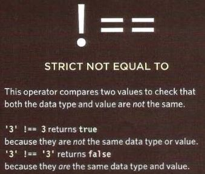

# Decisions & Loops

## Comparison Operators

**- Evaluating Conditions:**

evaluate a situation by comparing one value in the script to what expected, the resilt will be either True or False.

But it is usually preferable to use the strict method.

And you should note these exceptions :

1. Every value can be treated as true or false if it is not a Boolean.

2. In short-circuit evaluation, a condition might not need to run.

**- Structuring Comparison operators:**

There is usuaally one operator and two operands. In any condition.
the operands are placed in each side of the operarator. theycan valuas or variables.

**- Using Comparison operators:**

You can evaluate two variables using a comparison operator to return a true or false value.

in the next example a user is taking a test, and the script tells the user whether they have passed this test round.

It start by sitting two variables:

1. pass to hold the pass mark.
2. score to hold the user score.

**- Using Expessions With Comparison Operators:**

The operand does not have to be a single value or variable name.
An operand can be an expression (evaluates into a single value).

**- Comparing Two Expressions:**

In the next example there are two rounds to the test and the code will check if the usar has achieved a new high score, beating the previous record.

the highest scores for each round are storedin two more variables.

**- Logical Operator:**

Comparison operators usually return single values of true and false.

Logical operatoss allow you to compar the results of mare than one comparison operator.

- Logical and

- Logical or

- Logical not

- Short-Circuit Evaluation

**- LOOPS:**

Loops check a condition. If it returns true , a code block will run. Then the condition will be checked again and if it still returns true , the code block will run again. It repeats until the condition returns false.

Now here is the three common types of loops:

- For

If you need to run code a specific number of times (most common loop).

- While

You can use the while loop if you dont know how many times the code should run

- Do While

similar to while loop but has one key difference it will always run the statments inside the curly braces at least once even if the condition evaluates to false.

**- Loop Counters:**

A for loop uses a counter as a condition.

This instructs the code to run a specified number of times.
here you can see the condition is made up of three statements:

- Initialization

- Condition

- Update

**Looping:**

**- Using while loops:**

Here is an example of a while loop It writes out the time the 5 times table . Another calculation is written into the variable called msg, each time loop is run

This loop will continue to run for as long as the condition in the parentheses is true.

